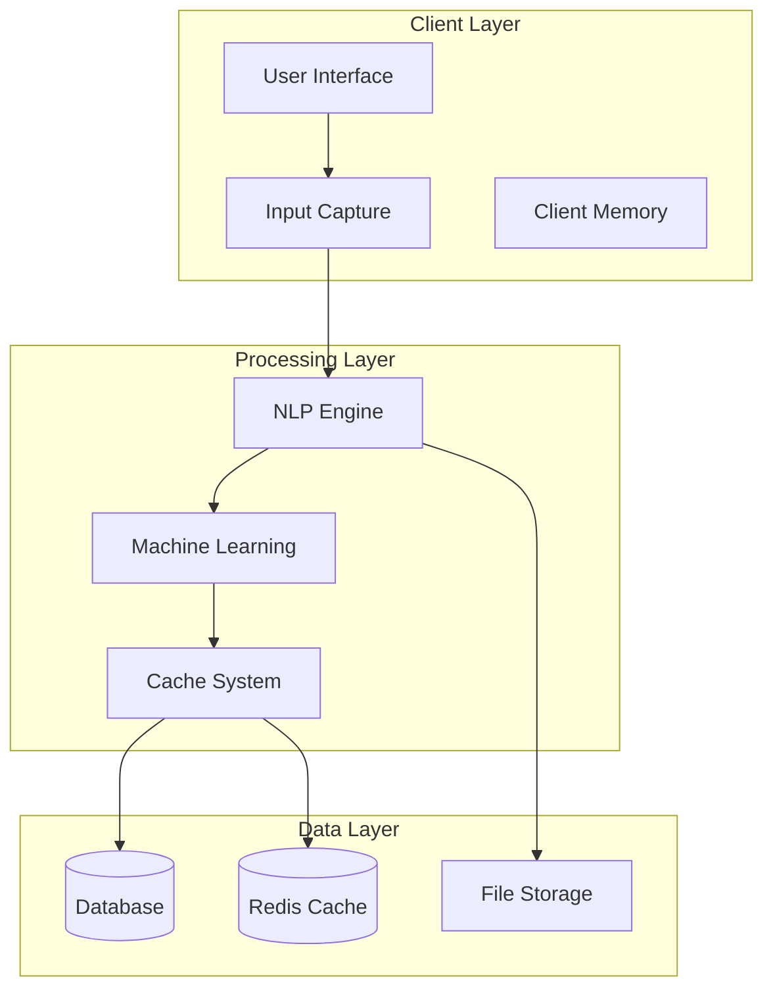
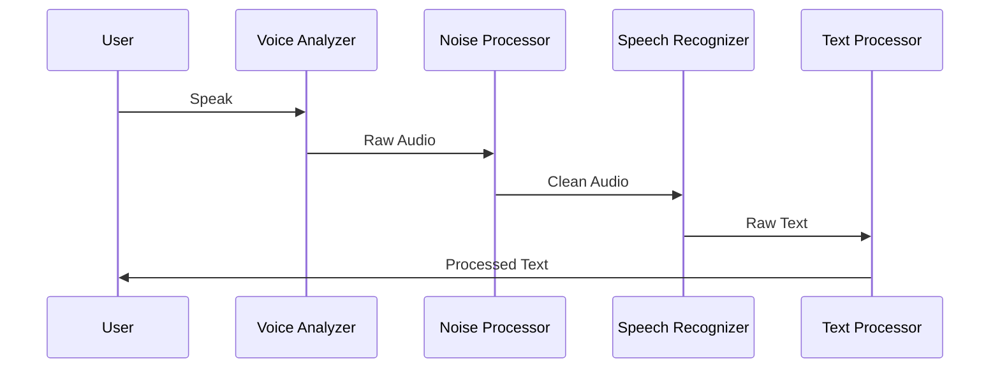
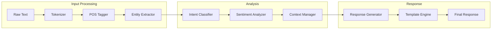
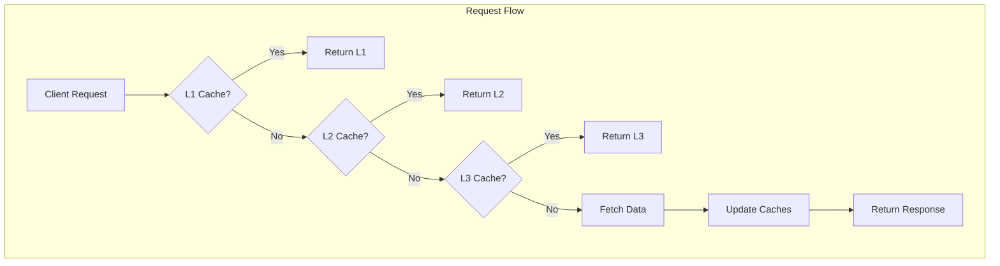
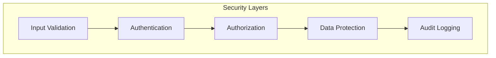
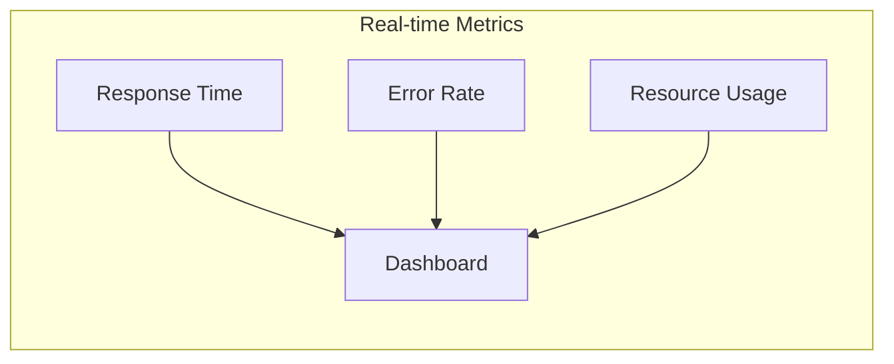

# Implementation Details & System Diagrams

## 1. System Architecture

### High-Level Architecture


## 2. Detailed Implementation Examples

### 2.1 Multilingual Support Implementation
```typescript
// Language Manager Implementation
class LanguageManager {
  private translations: Map<string, Map<string, string>>;
  private currentLanguage: string;
  private fallbackLanguage: string;

  constructor() {
    this.translations = new Map();
    this.currentLanguage = 'en';
    this.fallbackLanguage = 'en';
    this.initializeTranslations();
  }

  private async initializeTranslations() {
    // Load translations from JSON files
    const languages = ['en', 'hi', 'mr'];
    for (const lang of languages) {
      const translations = await import(`./translations/${lang}.json`);
      this.translations.set(lang, new Map(Object.entries(translations)));
    }
  }

  public translate(key: string, params?: Record<string, string>): string {
    let text = this.translations.get(this.currentLanguage)?.get(key) 
      || this.translations.get(this.fallbackLanguage)?.get(key) 
      || key;

    if (params) {
      Object.entries(params).forEach(([key, value]) => {
        text = text.replace(`{${key}}`, value);
      });
    }

    return text;
  }
}

// Usage Example
const langManager = new LanguageManager();
const greeting = langManager.translate('welcome', { name: 'Student' });
```

### 2.2 Voice Processing Pipeline


```typescript
// Voice Processing Implementation
class VoiceProcessor {
  private readonly config: VoiceConfig;
  private audioContext: AudioContext;
  private analyzer: AnalyserNode;

  constructor(config: VoiceConfig) {
    this.config = config;
    this.audioContext = new AudioContext();
    this.analyzer = this.audioContext.createAnalyser();
    this.setupAudioPipeline();
  }

  private async setupAudioPipeline() {
    const stream = await navigator.mediaDevices.getUserMedia({ audio: true });
    const source = this.audioContext.createMediaStreamSource(stream);
    source.connect(this.analyzer);
    
    // Configure analyzer
    this.analyzer.fftSize = 2048;
    this.analyzer.minDecibels = -90;
    this.analyzer.maxDecibels = -10;
    this.analyzer.smoothingTimeConstant = 0.85;
  }

  public async processVoiceInput(): Promise<string> {
    const recognition = new webkitSpeechRecognition();
    recognition.continuous = false;
    recognition.interimResults = true;
    recognition.lang = this.config.language;

    return new Promise((resolve, reject) => {
      recognition.onresult = (event) => {
        const transcript = event.results[0][0].transcript;
        const confidence = event.results[0][0].confidence;
        
        if (confidence > this.config.confidenceThreshold) {
          resolve(this.postProcess(transcript));
        } else {
          reject(new Error('Low confidence in voice recognition'));
        }
      };

      recognition.start();
    });
  }

  private postProcess(text: string): string {
    // Apply noise reduction and text cleanup
    return text
      .trim()
      .toLowerCase()
      .replace(/\s+/g, ' ');
  }
}
```

### 2.3 NLP Pipeline Implementation


```typescript
// NLP Pipeline Implementation
class NLPPipeline {
  private tokenizer: Tokenizer;
  private entityExtractor: EntityExtractor;
  private contextManager: ContextManager;

  constructor() {
    this.tokenizer = new Tokenizer();
    this.entityExtractor = new EntityExtractor();
    this.contextManager = new ContextManager();
  }

  public async process(input: string): Promise<NLPResult> {
    // 1. Tokenization
    const tokens = await this.tokenizer.tokenize(input);
    
    // 2. Entity Extraction
    const entities = await this.entityExtractor.extract(tokens);
    
    // 3. Context Enhancement
    const context = await this.contextManager.enhance(entities);
    
    // 4. Intent Classification
    const intent = await this.classifyIntent(tokens, context);
    
    // 5. Response Generation
    return this.generateResponse(intent, context);
  }

  private async classifyIntent(
    tokens: string[], 
    context: Context
  ): Promise<Intent> {
    const features = this.extractFeatures(tokens);
    const intentScores = await this.model.predict(features);
    return this.selectBestIntent(intentScores, context);
  }

  private async generateResponse(
    intent: Intent, 
    context: Context
  ): Promise<NLPResult> {
    const template = this.selectTemplate(intent);
    const filledTemplate = this.fillTemplate(template, context);
    
    return {
      response: filledTemplate,
      confidence: this.calculateConfidence(intent),
      entities: context.entities,
      intent: intent.type
    };
  }
}
```

### 2.4 Caching System Architecture


```typescript
// Multi-layer Cache Implementation
class MultiLayerCache {
  private L1: Map<string, CacheEntry>;
  private L2: RedisClient;
  private L3: DiskCache;

  constructor() {
    this.L1 = new Map();
    this.L2 = new RedisClient();
    this.L3 = new DiskCache();
  }

  public async get(key: string): Promise<any> {
    // Try L1 (Memory Cache)
    const L1Result = this.L1.get(key);
    if (L1Result && !this.isExpired(L1Result)) {
      return L1Result.data;
    }

    // Try L2 (Redis)
    const L2Result = await this.L2.get(key);
    if (L2Result) {
      await this.updateL1(key, L2Result);
      return L2Result;
    }

    // Try L3 (Disk)
    const L3Result = await this.L3.get(key);
    if (L3Result) {
      await this.updateL1AndL2(key, L3Result);
      return L3Result;
    }

    return null;
  }

  public async set(
    key: string, 
    value: any, 
    options: CacheOptions
  ): Promise<void> {
    const entry = this.createCacheEntry(value, options);

    // Update all layers
    await Promise.all([
      this.L1.set(key, entry),
      this.L2.set(key, value, options),
      this.L3.set(key, value, options)
    ]);
  }

  private async updateL1(key: string, value: any): Promise<void> {
    this.L1.set(key, this.createCacheEntry(value, { ttl: 300 })); // 5 minutes
  }

  private async updateL1AndL2(key: string, value: any): Promise<void> {
    await Promise.all([
      this.updateL1(key, value),
      this.L2.set(key, value, { ttl: 3600 }) // 1 hour
    ]);
  }

  private isExpired(entry: CacheEntry): boolean {
    return Date.now() > entry.expiresAt;
  }
}
```

### 2.5 Security Implementation


```typescript
// Security Pipeline Implementation
class SecurityPipeline {
  private validator: InputValidator;
  private authenticator: Authenticator;
  private encryptor: Encryptor;
  private auditor: AuditLogger;

  constructor() {
    this.validator = new InputValidator();
    this.authenticator = new Authenticator();
    this.encryptor = new Encryptor();
    this.auditor = new AuditLogger();
  }

  public async processRequest(
    request: Request
  ): Promise<SecurityResult> {
    try {
      // 1. Input Validation
      const validatedInput = await this.validator.validate(request.data);
      
      // 2. Authentication
      const authResult = await this.authenticator.verify(request.token);
      
      // 3. Authorization
      const permissions = await this.checkPermissions(
        authResult.userId,
        request.resource
      );
      
      // 4. Data Protection
      const secureData = await this.encryptor.protect(validatedInput);
      
      // 5. Audit Logging
      await this.auditor.log({
        userId: authResult.userId,
        action: request.action,
        resource: request.resource,
        timestamp: new Date()
      });

      return {
        isValid: true,
        data: secureData,
        permissions
      };
    } catch (error) {
      await this.auditor.logError(error);
      throw new SecurityError(error.message);
    }
  }
}
```

## 3. Performance Monitoring

### 3.1 Metrics Dashboard


```typescript
// Performance Monitoring Implementation
class PerformanceMonitor {
  private metrics: MetricsCollector;
  private alerting: AlertSystem;
  private dashboard: Dashboard;

  constructor() {
    this.metrics = new MetricsCollector();
    this.alerting = new AlertSystem();
    this.dashboard = new Dashboard();
  }

  public async trackMetrics(): Promise<void> {
    setInterval(async () => {
      const metrics = await this.collectMetrics();
      await this.processMetrics(metrics);
    }, 5000); // Every 5 seconds
  }

  private async collectMetrics(): Promise<Metrics> {
    return {
      responseTime: await this.metrics.getResponseTime(),
      errorRate: await this.metrics.getErrorRate(),
      resourceUsage: await this.metrics.getResourceUsage(),
      timestamp: new Date()
    };
  }

  private async processMetrics(metrics: Metrics): Promise<void> {
    // Update dashboard
    await this.dashboard.update(metrics);

    // Check thresholds and alert if necessary
    if (metrics.errorRate > this.alerting.threshold) {
      await this.alerting.sendAlert({
        type: 'HighErrorRate',
        value: metrics.errorRate,
        timestamp: metrics.timestamp
      });
    }
  }
}
```

These implementations provide a detailed view of how each component works and interacts with others in the system. The diagrams help visualize the flow of data and the relationships between different parts of the application. 