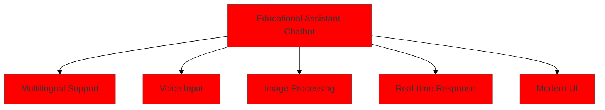

# Educational Assistant Chatbot
## Interactive Presentation with Animations

---

# Animation Guidelines

## Transition Effects
- Entry animations: Fade In, Slide In
- Exit animations: Fade Out, Slide Out
- Emphasis: Scale, Highlight, Pulse
- Timing: 0.5s - 0.8s per transition

---

# Slide 1: Project Overview
[Animation Sequence]

1. **Title Entry** (0.0s - 0.5s)
   ```css
   @keyframes titleEntry {
     from { opacity: 0; transform: translateY(-20px); }
     to { opacity: 1; transform: translateY(0); }
   }
   ```

2. **Feature Icons** (0.5s - 1.5s)
   ```css
   @keyframes featureIconPop {
     0% { scale: 0; }
     70% { scale: 1.1; }
     100% { scale: 1; }
   }
   ```

3. **Connection Lines** (1.5s - 2.0s)
   ```css
   @keyframes drawLine {
     from { stroke-dashoffset: 1000; }
     to { stroke-dashoffset: 0; }
   }
   ```



---

# Slide 2: Technical Architecture
[Animation Sequence]

1. **Layer Entry** (0.0s - 1.5s)
   ```css
   @keyframes layerStagger {
     from { transform: translateX(-100%); opacity: 0; }
     to { transform: translateX(0); opacity: 1; }
   }
   ```

2. **Component Reveal** (1.5s - 2.5s)
   ```css
   @keyframes componentFade {
     0% { opacity: 0; }
     100% { opacity: 1; }
   }
   ```

3. **Connection Highlight** (2.5s - 3.5s)
   ```css
   @keyframes connectionPulse {
     0% { stroke-width: 1; stroke: #333; }
     50% { stroke-width: 3; stroke: #007bff; }
     100% { stroke-width: 1; stroke: #333; }
   }
   ```

---

# Slide 3: NLP Pipeline
[Animation Sequence]

1. **Pipeline Steps** (0.0s - 3.0s)
   ```css
   @keyframes stepReveal {
     0% { transform: translateY(20px); opacity: 0; }
     100% { transform: translateY(0); opacity: 1; }
   }
   ```

2. **Data Flow Animation** (3.0s - 4.0s)
   ```css
   @keyframes dataFlow {
     0% { stroke-dashoffset: 1000; }
     100% { stroke-dashoffset: 0; }
   }
   ```

3. **Processing Highlight** (4.0s - 5.0s)
   ```css
   @keyframes processHighlight {
     0% { fill: #fff; }
     50% { fill: #007bff; }
     100% { fill: #fff; }
   }
   ```

---

# Slide 4: Interactive Demo
[Animation Sequence]

1. **Chat Interface Entry** (0.0s - 1.0s)
   ```css
   @keyframes interfaceSlide {
     from { transform: translateX(100%); }
     to { transform: translateX(0); }
   }
   ```

2. **Message Typing** (1.0s - 2.0s)
   ```css
   @keyframes typingDots {
     0% { content: '.'; }
     33% { content: '..'; }
     66% { content: '...'; }
     100% { content: ''; }
   }
   ```

3. **Response Generation** (2.0s - 3.0s)
   ```css
   @keyframes responseAppear {
     0% { height: 0; opacity: 0; }
     100% { height: auto; opacity: 1; }
   }
   ```

---

# Slide 5: Performance Metrics
[Animation Sequence]

1. **Chart Entry** (0.0s - 1.0s)
   ```css
   @keyframes chartBuild {
     from { height: 0; }
     to { height: 100%; }
   }
   ```

2. **Data Point Population** (1.0s - 2.0s)
   ```css
   @keyframes dataPoint {
     0% { transform: scale(0); }
     70% { transform: scale(1.2); }
     100% { transform: scale(1); }
   }
   ```

3. **Metric Updates** (2.0s - 3.0s)
   ```css
   @keyframes metricUpdate {
     0% { color: #333; }
     50% { color: #00ff00; }
     100% { color: #333; }
   }
   ```

---

# Slide 6: Security Features
[Animation Sequence]

1. **Shield Icon** (0.0s - 1.0s)
   ```css
   @keyframes shieldRotate {
     from { transform: rotateY(180deg); opacity: 0; }
     to { transform: rotateY(0); opacity: 1; }
   }
   ```

2. **Security Layers** (1.0s - 2.0s)
   ```css
   @keyframes layerStack {
     0% { transform: translateY(100%); }
     100% { transform: translateY(0); }
   }
   ```

3. **Lock Animation** (2.0s - 3.0s)
   ```css
   @keyframes lockClose {
     0% { transform: translateY(-20px); }
     100% { transform: translateY(0); }
   }
   ```

---

# Slide 7: Future Roadmap
[Animation Sequence]

1. **Timeline Entry** (0.0s - 1.5s)
   ```css
   @keyframes timelineGrow {
     from { width: 0; }
     to { width: 100%; }
   }
   ```

2. **Milestone Pop** (1.5s - 2.5s)
   ```css
   @keyframes milestoneReveal {
     0% { transform: scale(0); }
     60% { transform: scale(1.2); }
     100% { transform: scale(1); }
   }
   ```

3. **Feature Cards** (2.5s - 3.5s)
   ```css
   @keyframes cardFlip {
     0% { transform: rotateY(90deg); }
     100% { transform: rotateY(0); }
   }
   ```

---

# Interactive Elements

## 1. Hover Effects
```css
.feature-card:hover {
  transform: translateY(-5px);
  box-shadow: 0 5px 15px rgba(0,0,0,0.3);
  transition: all 0.3s ease;
}
```

## 2. Click Animations
```css
.button:active {
  transform: scale(0.95);
  transition: transform 0.1s;
}
```

## 3. Focus States
```css
.interactive-element:focus {
  outline: none;
  ring: 2px solid #007bff;
  animation: focusPulse 1s infinite;
}
```

---

# Transition Effects

## 1. Slide Transitions
```css
.slide-transition {
  transition: all 0.5s cubic-bezier(0.4, 0, 0.2, 1);
}
```

## 2. Content Transitions
```css
.content-fade {
  animation: contentFade 0.3s ease-in-out;
}
```

## 3. Emphasis Effects
```css
.emphasis {
  animation: emphasize 0.5s ease-in-out;
}
```

---

# Animation Timing Guide

1. **Opening Sequence** (0-5s)
   - Logo reveal
   - Title entry
   - Feature showcase

2. **Content Transitions** (per slide)
   - Entry: 0.5s
   - Content reveal: 0.3s per item
   - Exit: 0.5s

3. **Interactive Demos** (per feature)
   - Setup: 1s
   - Interaction: 2-3s
   - Result: 1s

4. **Closing Sequence** (3-5s)
   - Summary cards
   - Contact information
   - Call to action

---

# Performance Considerations

1. **Animation Optimization**
   ```javascript
   {
     will-change: transform, opacity;
     transform: translateZ(0);
     backface-visibility: hidden;
   }
   ```

2. **Reduced Motion**
   ```css
   @media (prefers-reduced-motion: reduce) {
     * {
       animation-duration: 0.01ms !important;
       transition-duration: 0.01ms !important;
     }
   }
   ```

3. **Resource Loading**
   ```javascript
   document.addEventListener('DOMContentLoaded', () => {
     // Initialize animations after content loads
   });
   ``` 