# Research Paper Diagrams and Flowcharts

## 1. System Architecture Overview (Enhanced)


## 2. Enhanced NLP Pipeline (Interactive)

```mermaid
flowchart LR
    %% Enhanced styling with gradients and detailed metrics
    classDef input fill:#e3f2fd,stroke:#1565c0,stroke-width:3px,rx:10,ry:10
    classDef analysis fill:#fff3e0,stroke:#e65100,stroke-width:3px,rx:10,ry:10
    classDef context fill:#f3e5f5,stroke:#4a148c,stroke-width:3px,rx:10,ry:10
    classDef output fill:#e8f5e9,stroke:#1b5e20,stroke-width:3px,rx:10,ry:10
    
    subgraph Input Stage["📥 Input Processing"]
        A["User Input<br/><small>Rate: 100/min<br/>Sources: 3<br/>Formats: 5<br/>Buffer: 2MB</small>"]:::input
        B["Text Preprocessing<br/><small>Clean Rate: 95%<br/>Unicode: UTF-8<br/>Lang: Multi<br/>Sanitize: XSS</small>"]:::input
        C["Tokenization<br/><small>Tokens/s: 1000<br/>Vocab: 50K<br/>Algorithm: BPE<br/>Cache: 90%</small>"]:::input
        D["POS Tagging<br/><small>Accuracy: 97%<br/>Tags: 45<br/>Model: spaCy<br/>Lang: 10+</small>"]:::input
        A -->|"Clean<br/>Filter: 99%<br/>Rules: 20<br/>ML: Active"| B
        B -->|"Split<br/>Avg Len: 10<br/>Max: 512<br/>UTF-8"| C
        C -->|"Tag<br/>Types: 45<br/>Speed: 5ms<br/>Batch: 32"| D
    end
    
    subgraph Analysis Stage["🔍 Deep Analysis"]
        E["Entity Recognition<br/><small>F1: 0.92<br/>Types: 18<br/>CRF+BERT<br/>GPU: T4</small>"]:::analysis
        F["Intent Classification<br/><small>Top-3: 95%<br/>Classes: 25<br/>CNN+LSTM<br/>Conf: 0.85</small>"]:::analysis
        G["Sentiment Analysis<br/><small>Accuracy: 89%<br/>Scale: -1 to 1<br/>VADER+RoBERTa<br/>Lang: Multi</small>"]:::analysis
        D -->|"Extract<br/>Entities: 50+<br/>Conf: 0.85<br/>Cache: Yes"| E
        E -->|"Classify<br/>Classes: 25<br/>Threshold: 0.7<br/>Async"| F
        F -->|"Evaluate<br/>Scale: -1 to 1<br/>Neutral: ±0.1<br/>ML: v2"| G
    end
    
    subgraph Context Stage["🧠 Context Processing"]
        H["Context Management<br/><small>Window: 5<br/>Memory: 2MB<br/>TTL: 30min<br/>LRU Cache</small>"]:::context
        I["Knowledge Graph Query<br/><small>Depth: 3<br/>Cache: 90%<br/>Neo4j<br/>Timeout: 2s</small>"]:::context
        J["Response Generation<br/><small>Templates: 100+<br/>Dynamic: Yes<br/>GPT-3<br/>Temp: 0.7</small>"]:::context
        G -->|"Build<br/>Memory: 1MB<br/>Compress: Yes<br/>Versioned"| H
        H -->|"Search<br/>Paths: 10<br/>Depth: 3<br/>Indexed"| I
        I -->|"Generate<br/>Options: 5<br/>Beam: 4<br/>Top-k: 40"| J
    end
    
    subgraph Output Stage["📤 Response Delivery"]
        K["Template Selection<br/><small>Match: 92%<br/>Fallback: 3<br/>Cache: 1h<br/>Auto: Yes</small>"]:::output
        L["Response Formatting<br/><small>Styles: 8<br/>Markdown: Yes<br/>i18n: 10<br/>RTL: Yes</small>"]:::output
        M["Final Response<br/><small>Latency: 150ms<br/>Size: 2KB<br/>QPS: 100<br/>SSL: Yes</small>"]:::output
        J -->|"Select<br/>Rules: 20<br/>Priority: High<br/>ML: Active"| K
        K -->|"Format<br/>Schema v2<br/>Valid: JSON<br/>Minify"| L
        L -->|"Deliver<br/>Size: 2KB<br/>Gzip: 70%<br/>CDN"| M
    end

    %% Enhanced stage styling
    style Input Stage fill:#e3f2fd,stroke:#1565c0,stroke-width:4px,rx:15,ry:15
    style Analysis Stage fill:#fff3e0,stroke:#e65100,stroke-width:4px,rx:15,ry:15
    style Context Stage fill:#f3e5f5,stroke:#4a148c,stroke-width:4px,rx:15,ry:15
    style Output Stage fill:#e8f5e9,stroke:#1b5e20,stroke-width:4px,rx:15,ry:15
```


## 2.1 Detailed NLP Components


## 2.2 NLP Context Management


## 2.3 NLP Pipeline Performance


## 3. Learning Process Flow


## 4. Multi-layer Caching Architecture


## 5. Security Implementation


## 6. Performance Monitoring System

```mermaid
graph LR
    classDef metrics fill:#e3f2fd,stroke:#1565c0,stroke-width:3px,rx:10,ry:10
    classDef analysis fill:#fff3e0,stroke:#e65100,stroke-width:3px,rx:10,ry:10
    classDef alert fill:#ffcdd2,stroke:#b71c1c,stroke-width:3px,rx:10,ry:10
    classDef visual fill:#c8e6c9,stroke:#1b5e20,stroke-width:3px,rx:10,ry:10
    
    subgraph Metrics Collection["📊 Real-time Metrics"]
        A["Response Time<br/><small>p50: 100ms<br/>p95: 150ms<br/>p99: 200ms</small>"]:::metrics
        B["Error Rate<br/><small>Overall: 0.1%<br/>Critical: 0.01%<br/>Trend: ↓</small>"]:::metrics
        C["Resource Usage<br/><small>CPU: 45%<br/>Memory: 75%<br/>Network: 60%</small>"]:::metrics
        D["Aggregator<br/><small>Rate: 1K/s<br/>Buffer: 5MB<br/>Flush: 1s</small>"]:::metrics
    end
    
    subgraph Real-time Analysis["🔍 Analysis Engine"]
        E["Stream Processing<br/><small>Kafka<br/>Partitions: 12<br/>Lag: 50ms</small>"]:::analysis
        F["Anomaly Detection<br/><small>Algorithm: ARIMA<br/>Window: 5min<br/>Accuracy: 95%</small>"]:::analysis
        G["Alert Generation<br/><small>Rules: 50+<br/>Priority: 1-5<br/>Channels: 3</small>"]:::alert
    end
    
    subgraph Visualization["📈 Dashboards"]
        H["Real-time Graphs<br/><small>Update: 5s<br/>Metrics: 100+<br/>Views: 10</small>"]:::visual
        I["System Reports<br/><small>Daily/Weekly<br/>PDF/HTML<br/>Auto-email</small>"]:::visual
        J["Alert Console<br/><small>Active: 24/7<br/>Mobile App<br/>Push: Yes</small>"]:::visual
    end
    
    A & B & C -->|"Collect<br/>Interval: 1s<br/>Batch: 100"| D
    D -->|"Process<br/>QPS: 10K<br/>Shards: 3"| E
    E -->|"Analyze<br/>ML: Yes<br/>Train: 1h"| F
    F -->|"Evaluate<br/>Rules: 50<br/>Auto: Yes"| G
    G -->|"Display<br/>Real-time<br/>Persist: Yes"| H
    H -->|"Generate<br/>Schedule: Daily<br/>Format: Multi"| I
    H -->|"Notify<br/>Priority: Auto<br/>Route: Smart"| J
    
    style Metrics Collection fill:#e3f2fd,stroke:#1565c0,stroke-width:4px,rx:15,ry:15
    style Real-time Analysis fill:#fff3e0,stroke:#e65100,stroke-width:4px,rx:15,ry:15
    style Visualization fill:#e8f5e9,stroke:#1b5e20,stroke-width:4px,rx:15,ry:15
```


## 7. User Interaction Flow


## 8. Machine Learning Pipeline


## 9. Error Handling System


## 10. Scalability Architecture


## 11. Data Flow Architecture
```mermaid
graph TB
    classDef external fill:#e3f2fd,stroke:#1565c0,stroke-width:3px,rx:10,ry:10
    classDef integration fill:#fff3e0,stroke:#e65100,stroke-width:3px,rx:10,ry:10
    classDef core fill:#f3e5f5,stroke:#4a148c,stroke-width:3px,rx:10,ry:10
    
    subgraph External Services["🌐 External Systems"]
        A["Third-party APIs<br/><small>Active: 15<br/>Uptime: 99.9%<br/>SSL: TLS 1.3<br/>Rate: 1K/s</small>"]:::external
    subgraph External Services
        A[Third-party APIs]
        B[Authentication Services]
        C[Storage Services]
    end
    
    subgraph Integration Layer
        D[API Gateway]
        E[Service Bus]
        F[Message Queue]
    end
    
    subgraph Core System
        G[Application Logic]
        H[Data Processing]
        I[Storage]
    end
    
    A --> D
    B --> D
    C --> D
    D --> E
    E --> F
    F --> G
    G --> H
    H --> I
```

## Feature-Specific Diagrams

### 1. Voice Processing Feature
```mermaid
graph LR
    classDef input fill:#e1f5fe,stroke:#01579b,stroke-width:2px,rx:10,ry:10
    classDef process fill:#fff3e0,stroke:#e65100,stroke-width:2px,rx:10,ry:10
    classDef output fill:#e8f5e9,stroke:#1b5e20,stroke-width:2px,rx:10,ry:10

    subgraph Audio Input["🎤 Audio Capture"]
        A["Microphone Input<br/><small>Sample: 48kHz<br/>Bit: 24-bit<br/>SNR: 85dB</small>"]:::input
        B["Audio Stream<br/><small>Codec: Opus<br/>Rate: 128kbps<br/>Buffer: 50ms</small>"]:::input
        C["Buffer Manager<br/><small>Size: 4MB<br/>Frames: 1024<br/>Overlap: 25%</small>"]:::input
        A -->|"Capture<br/>Gain: Auto<br/>AGC: On"| B
        B -->|"Buffer<br/>Loss: <0.1%"| C
    end

    subgraph Processing["⚙️ Voice Analysis"]
        D["Voice Activity Detection<br/><small>Model: WebRTC<br/>Threshold: -26dB<br/>Window: 30ms</small>"]:::process
        E["Speech-to-Text<br/><small>Model: Whisper<br/>WER: 5%<br/>RTF: 0.8</small>"]:::process
        F["Noise Reduction<br/><small>Type: RNNoise<br/>NR: 25dB<br/>Latency: 10ms</small>"]:::process
        C -->|"Process<br/>Chunk: 20ms"| D
        D -->|"Clean<br/>SNR: +15dB"| F
        F -->|"Convert<br/>Lang: Multi"| E
    end

    subgraph Output["📤 Results"]
    classDef input fill:#e1f5fe,stroke:#01579b,stroke-width:2px
    classDef process fill:#fff3e0,stroke:#e65100,stroke-width:2px
    classDef output fill:#e8f5e9,stroke:#1b5e20,stroke-width:2px

    subgraph Audio Input
        A[Microphone Input]:::input
        B[Audio Stream]:::input
        C[Buffer]:::input
        A -->|Capture| B
        B -->|Buffer| C
    end

    subgraph Processing
        D[Voice Activity Detection]:::process
        E[Speech-to-Text]:::process
        F[Noise Reduction]:::process
        C -->|Process| D
        D -->|Clean| F
        F -->|Convert| E
    end

    subgraph Output
        G[Text Output]:::output
        H[Confidence Score]:::output
        E -->|Generate| G
        E -->|Calculate| H
    end

    style Audio Input fill:#e1f5fe,stroke:#01579b,stroke-width:4px
    style Processing fill:#fff3e0,stroke:#e65100,stroke-width:4px
    style Output fill:#e8f5e9,stroke:#1b5e20,stroke-width:4px
```

### 2. Image Analysis Feature


### 3. Performance Metrics Graph


### 4. Learning Analytics


### 5. Real-time Processing Pipeline


### 6. Error Rate Analysis


### 7. Resource Utilization
```mermaid
pie title Resource Distribution
    "CPU" : 35
    "Memory" : 25
    "Network" : 20
    "Storage" : 15
    "Other" : 5
```

### 8. Interactive Learning Flow
```mermaid
stateDiagram-v2
    [*] --> UserInput
    UserInput --> Analysis
    Analysis --> Knowledge
    Knowledge --> Response
    Response --> Feedback
    Feedback --> Analysis
    Response --> [*]

    state Analysis {
        [*] --> TextAnalysis
        TextAnalysis --> IntentDetection
        IntentDetection --> ContextBuilding
        ContextBuilding --> [*]
    }

    state Knowledge {
        [*] --> Query
        Query --> Retrieve
        Retrieve --> Update
        Update --> [*]
    }
```

### 9. System Load Distribution
```mermaid
xychart-beta
    title "System Load Distribution"
    x-axis [00:00, 06:00, 12:00, 18:00, 24:00]
    y-axis "Load (%)" 0 --> 100
    line [20, 35, 85, 75, 25]
```

### 10. Feature Usage Analytics
```mermaid
pie title Feature Usage Distribution
    "NLP Processing" : 40
    "Voice Recognition" : 25
    "Image Analysis" : 20
    "Context Management" : 15
```

### 11. Response Time Distribution
```mermaid
xychart-beta
    title "Response Time Distribution"
    x-axis [Fast, Medium, Slow]
    y-axis "Percentage" 0 --> 100
    bar [75, 20, 5]
```

### 12. Memory Usage Pattern
```mermaid
graph LR
    classDef low fill:#e8f5e9,stroke:#1b5e20,stroke-width:2px
    classDef medium fill:#fff3e0,stroke:#e65100,stroke-width:2px
    classDef high fill:#ffebee,stroke:#b71c1c,stroke-width:2px

    A[Startup]:::low -->|Initialize| B[Normal Load]:::low
    B -->|User Activity| C[Peak Load]:::medium
    C -->|Optimization| D[Stabilized]:::low
    D -->|Cleanup| B
    C -->|Overflow| E[High Load]:::high
    E -->|Recovery| C

    style A fill:#e8f5e9,stroke:#1b5e20,stroke-width:2px
    style B fill:#e8f5e9,stroke:#1b5e20,stroke-width:2px
    style C fill:#fff3e0,stroke:#e65100,stroke-width:2px
    style D fill:#e8f5e9,stroke:#1b5e20,stroke-width:2px
    style E fill:#ffebee,stroke:#b71c1c,stroke-width:2px
```

## Advanced Analytics and Feature Details

### 13. User Engagement Metrics
```mermaid
xychart-beta
    title "User Engagement Over Time"
    x-axis ["Week 1", "Week 2", "Week 3", "Week 4", "Week 5", "Week 6"]
    y-axis "Engagement Score" 0 --> 100
    line [45, 52, 61, 75, 85, 92]
    bar [40, 48, 55, 70, 80, 88]
    title "Blue: Active Users, Red: Session Duration"
```

### 14. Learning Progress Analytics
```mermaid
xychart-beta
    title "Student Learning Progress"
    x-axis ["Topic 1", "Topic 2", "Topic 3", "Topic 4", "Topic 5"]
    y-axis "Mastery Level (%)" 0 --> 100
    bar [65, 78, 82, 88, 92]
    line [70, 75, 85, 90, 95]
    title "Blue: Current Progress, Red: Target Progress"
```

### 15. Detailed Voice Processing Pipeline
```mermaid
graph TB
    classDef input fill:#e3f2fd,stroke:#1565c0,stroke-width:2px
    classDef process fill:#fff3e0,stroke:#e65100,stroke-width:2px
    classDef analysis fill:#f3e5f5,stroke:#4a148c,stroke-width:2px
    classDef output fill:#e8f5e9,stroke:#1b5e20,stroke-width:2px

    subgraph Audio Capture
        A[Microphone]:::input -->|Raw Audio| B[Audio Buffer]:::input
        B -->|Streaming| C[Signal Processing]:::process
    end

    subgraph Voice Analysis
        C -->|Process| D[Noise Reduction]:::process
        D -->|Clean| E[Voice Activity Detection]:::process
        E -->|Segment| F[Feature Extraction]:::analysis
    end

    subgraph Speech Recognition
        F -->|Analyze| G[Phoneme Recognition]:::analysis
        G -->|Process| H[Word Recognition]:::analysis
        H -->|Combine| I[Sentence Formation]:::analysis
    end

    subgraph Output Processing
        I -->|Generate| J[Text Output]:::output
        I -->|Calculate| K[Confidence Score]:::output
        I -->|Extract| L[Metadata]:::output
    end

    style Audio Capture fill:#e3f2fd,stroke:#1565c0,stroke-width:4px
    style Voice Analysis fill:#fff3e0,stroke:#e65100,stroke-width:4px
    style Speech Recognition fill:#f3e5f5,stroke:#4a148c,stroke-width:4px
    style Output Processing fill:#e8f5e9,stroke:#1b5e20,stroke-width:4px
```

### 16. Knowledge Graph Analytics
```mermaid
graph LR
    classDef concept fill:#e1bee7,stroke:#4a148c,stroke-width:2px,rx:10,ry:10
    classDef relation fill:#bbdefb,stroke:#0d47a1,stroke-width:2px,rx:10,ry:10
    classDef metric fill:#c8e6c9,stroke:#1b5e20,stroke-width:2px,rx:10,ry:10

    A[Mathematics]:::concept -->|includes| B[Algebra]:::concept
    B -->|requires| C[Basic Arithmetic]:::concept
    A -->|connects to| D[Physics]:::concept
    D -->|uses| B
    
    subgraph Metrics
        E[Concept Mastery]:::metric
        F[Connection Strength]:::metric
        G[Learning Path]:::metric
    end

    B --> E
    A --> F
    D --> G

    style Metrics fill:#f3e5f5,stroke:#4a148c,stroke-width:4px
```

### 17. Real-time Performance Dashboard
```mermaid
graph TB
    classDef metric fill:#bbdefb,stroke:#0d47a1,stroke-width:3px,rx:10,ry:10
    classDef alert fill:#ffcdd2,stroke:#b71c1c,stroke-width:3px,rx:10,ry:10
    classDef status fill:#c8e6c9,stroke:#1b5e20,stroke-width:3px,rx:10,ry:10

    subgraph System Metrics["📊 System Metrics"]
        A["CPU Usage<br/>45% | Peak: 75%<br/><small>Threads: 24</small>"]:::metric
        B["Memory<br/>2.8GB | Max: 4GB<br/><small>Heap: 2GB</small>"]:::metric
        C["Network<br/>150Mbps | Peak: 200Mbps<br/><small>Connections: 1000</small>"]:::metric
    end

    subgraph Alerts["⚠️ System Alerts"]
        D["High Load<br/>Threshold: 80%<br/><small>Duration: 5min</small>"]:::alert
        E["Memory Warning<br/>Usage: 70%<br/><small>Trend: ↑</small>"]:::alert
        F["Network Latency<br/>Spike: 200ms<br/><small>Affected: 5%</small>"]:::alert
    end

    subgraph Status["✅ Service Status"]
        G["Services Online<br/>12/12 Active<br/><small>Health: 100%</small>"]:::status
        H["System Uptime<br/>99.9%<br/><small>30 days</small>"]:::status
        I["Response Time<br/>120ms Avg<br/><small>p95: 180ms</small>"]:::status
    end
    
    %% Enhanced relationships with detailed metrics
    A -->|"Monitor"| D
    B -->|"Alert"| E
    C -->|"Track"| F
    D & E & F -->|"Log"| G
    G -->|"Report"| H
    H -->|"Analyze"| I

    style System Metrics fill:#bbdefb,stroke:#0d47a1,stroke-width:4px,rx:15,ry:15
    style Alerts fill:#ffcdd2,stroke:#b71c1c,stroke-width:4px,rx:15,ry:15
    style Status fill:#c8e6c9,stroke:#1b5e20,stroke-width:4px,rx:15,ry:15
```

### 18. Learning Path Visualization
```mermaid
graph TB
    classDef basic fill:#e3f2fd,stroke:#1565c0,stroke-width:2px
    classDef intermediate fill:#fff3e0,stroke:#e65100,stroke-width:2px
    classDef advanced fill:#f3e5f5,stroke:#4a148c,stroke-width:2px

    subgraph Basic Level
        A[Fundamentals]:::basic -->|Master| B[Core Concepts]:::basic
        B -->|Complete| C[Basic Practice]:::basic
    end

    subgraph Intermediate Level
        C -->|Progress| D[Advanced Concepts]:::intermediate
        D -->|Apply| E[Problem Solving]:::intermediate
        E -->|Practice| F[Real-world Applications]:::intermediate
    end

    subgraph Advanced Level
        F -->|Advance| G[Expert Topics]:::advanced
        G -->|Research| H[Independent Study]:::advanced
        H -->|Create| I[Original Content]:::advanced
    end

    style Basic Level fill:#e3f2fd,stroke:#1565c0,stroke-width:4px
    style Intermediate Level fill:#fff3e0,stroke:#e65100,stroke-width:4px
    style Advanced Level fill:#f3e5f5,stroke:#4a148c,stroke-width:4px
```

### 19. Content Recommendation Engine
```mermaid
graph LR
    classDef healthy fill:#c8e6c9,stroke:#1b5e20,stroke-width:2px,rx:10,ry:10
    classDef warning fill:#fff3e0,stroke:#e65100,stroke-width:2px,rx:10,ry:10
    classDef error fill:#ffcdd2,stroke:#b71c1c,stroke-width:2px,rx:10,ry:10

    subgraph Health Status["🏥 System Health"]
        A["NLP Engine<br/><small>CPU: 45%<br/>Memory: 2.8GB<br/>Errors: 0.01%<br/>Status: OK</small>"]:::healthy
        B["Database<br/><small>Connections: 850/1000<br/>Query Time: 150ms<br/>Deadlocks: 2<br/>Status: Warning</small>"]:::warning
        C["Cache<br/><small>Miss Rate: 25%<br/>Evictions: High<br/>Memory: 95%<br/>Status: Critical</small>"]:::error
    end

    subgraph Recovery Actions["🔄 Auto Recovery"]
        D["Auto-scaling<br/><small>Target: +2 nodes<br/>Time: 3min<br/>Cost: Optimal</small>"]:::healthy
        E["Connection Pool<br/><small>Cleanup: Active<br/>Timeout: 30s<br/>Retry: 3x</small>"]:::warning
        F["Cache Flush<br/><small>Priority: High<br/>ETA: 1min<br/>Impact: Low</small>"]:::error
    end

    A -->|"Monitor<br/>Interval: 5s<br/>Metrics: 20"| D
    B -->|"Resolve<br/>Auto: Yes<br/>Alert: SMS"| E
    C -->|"Fix<br/>Immediate<br/>Backup: Yes"| F

    style Health Status fill:#f5f5f5,stroke:#212121,stroke-width:4px,rx:15,ry:15
    subgraph Recommendations
        G["Personalized Content<br/><small>Items: 20<br/>Refresh: 1h<br/>CTR: 15%</small>"]:::output
        H["Difficulty Level<br/><small>Range: 1-5<br/>Adaptive: Yes<br/>Steps: 0.5</small>"]:::output
        I["Learning Path<br/><small>Length: 8w<br/>Milestones: 12<br/>Success: 85%</small>"]:::output
    end

    A & B & C -->|"Input<br/>Rate: 100/s<br/>Valid: 99%"| D
    D -->|"Process<br/>Time: 50ms"| E
    E -->|"Match<br/>Top-k: 10"| F
    F -->|"Generate<br/>Conf: 0.9"| G & H & I

    style User Data fill:#e1bee7,stroke:#4a148c,stroke-width:4px,rx:15,ry:15
    style Processing fill:#bbdefb,stroke:#0d47a1,stroke-width:4px,rx:15,ry:15
    style Recommendations fill:#c8e6c9,stroke:#1b5e20,stroke-width:4px,rx:15,ry:15
```

### 20. System Health Monitoring
```mermaid
xychart-beta
    title "System Health Metrics"
    x-axis ["1h", "2h", "3h", "4h", "5h", "6h"]
    y-axis "Performance Score" 0 --> 100
    line [92, 95, 88, 91, 94, 96]
    bar [90, 93, 85, 89, 92, 95]
    title "Blue: System Health, Red: Resource Utilization"
```

### 21. User Satisfaction Metrics
```mermaid
pie title User Satisfaction Distribution
    "Very Satisfied" : 45
    "Satisfied" : 35
    "Neutral" : 15
    "Needs Improvement" : 5
```

### 22. Learning Style Distribution
```mermaid
pie title Learning Style Preferences
    "Visual" : 40
    "Auditory" : 25
    "Reading/Writing" : 20
    "Kinesthetic" : 15
```

## Technical Specifications and Error States

### 23. Detailed Component Specifications
```mermaid
graph TB
    classDef component fill:#e3f2fd,stroke:#1565c0,stroke-width:3px,rx:10,ry:10
    classDef spec fill:#fff3e0,stroke:#e65100,stroke-width:3px,rx:10,ry:10
    
    subgraph NLP Engine["🔄 NLP Engine Specifications"]
        A["Model: Transformer-based<br/>Version: 2.1.0<br/>Vocab Size: 50K<br/>Layers: 12<br/>Attention Heads: 8<br/>Hidden Size: 768<br/>Parameters: 110M"]:::component
        B["Memory Usage: 2.5GB<br/>Batch Size: 32<br/>Sequence Length: 512<br/>FLOPs: 89B<br/>Throughput: 100req/s"]:::spec
    end

    subgraph Voice Module["🎤 Voice Processing Specs"]
        C["Sample Rate: 16kHz<br/>Bit Depth: 16-bit<br/>Channels: Mono<br/>Format: PCM WAV<br/>Buffer Size: 4096<br/>Latency: <50ms"]:::component
        D["VAD Threshold: -26dB<br/>SNR Min: 15dB<br/>Codec: Opus<br/>Frame Size: 20ms"]:::spec
    end

    subgraph Cache System["💾 Cache Specifications"]
        E["L1: Redis 6.2<br/>Memory: 8GB<br/>Max Keys: 1M<br/>TTL: 1h<br/>Eviction: LRU"]:::component
        F["L2: Memcached 1.6<br/>Size: 16GB<br/>Items: 2M<br/>Expiry: 4h"]:::spec
    end

    style NLP Engine fill:#e3f2fd,stroke:#1565c0,stroke-width:4px
    style Voice Module fill:#fff3e0,stroke:#e65100,stroke-width:4px
    style Cache System fill:#f3e5f5,stroke:#4a148c,stroke-width:4px
```

### 24. Error States and Recovery Flow
```mermaid
stateDiagram-v2
    [*] --> Normal
    Normal --> Warning: High Load (CPU > 80%)
    Normal --> Error: Connection Lost
    Normal --> Critical: System Failure
    
    state Warning {
        [*] --> LoadBalancing
        LoadBalancing --> ScaleUp
        ScaleUp --> HealthCheck
        HealthCheck --> [*]
    }
    
    state Error {
        [*] --> RetryConnection
        RetryConnection --> BackoffDelay
        BackoffDelay --> ReestablishConnection
        ReestablishConnection --> [*]
    }
    
    state Critical {
        [*] --> EmergencyShutdown
        EmergencyShutdown --> DataBackup
        DataBackup --> SystemRestore
        SystemRestore --> [*]
    }
    
    Warning --> Normal: Load Normalized
    Error --> Normal: Connection Restored
    Critical --> Normal: System Recovered
```

### 25. Component Health Monitoring
```mermaid
graph LR
    classDef healthy fill:#c8e6c9,stroke:#1b5e20,stroke-width:2px
    classDef warning fill:#fff3e0,stroke:#e65100,stroke-width:2px,rx:10,ry:10
    classDef error fill:#ffcdd2,stroke:#b71c1c,stroke-width:2px,rx:10,ry:10
    
    subgraph Health Status
        A["NLP Engine<br/>CPU: 45%<br/>Memory: 2.8GB<br/>Errors: 0.01%<br/>Status: OK"]:::healthy
        B["Database<br/>Connections: 850/1000<br/>Query Time: 150ms<br/>Deadlocks: 2<br/>Status: Warning"]:::warning
        C["Cache<br/>Miss Rate: 25%<br/>Evictions: High<br/>Memory: 95%<br/>Status: Critical"]:::error
    end
    
    subgraph Recovery Actions
        D["Auto-scaling<br/>Target: +2 nodes<br/>Time: 3min"]:::healthy
        E["Connection Pool<br/>Cleanup: Active<br/>Timeout: 30s"]:::warning
        F["Cache Flush<br/>Priority: High<br/>ETA: 1min"]:::error
    end
    
    A -->|Monitor| D
    B -->|Resolve| E
    C -->|Fix| F
```

### 26. Error Recovery Pipeline
```mermaid
graph TB
    classDef error fill:#ffcdd2,stroke:#b71c1c,stroke-width:3px,rx:10,ry:10
    classDef recovery fill:#c8e6c9,stroke:#1b5e20,stroke-width:3px,rx:10,ry:10
    classDef monitor fill:#bbdefb,stroke:#0d47a1,stroke-width:3px,rx:10,ry:10

    subgraph Error Detection["🚨 Error Detection"]
        A["Error Trigger<br/><small>Type: System<br/>Severity: High<br/>Impact: Global<br/>Time: Now</small>"]:::error
        B["Diagnostics<br/><small>Traces: 150<br/>Logs: 2.5GB<br/>Time: 30s<br/>ML: Active</small>"]:::error
    end

    subgraph Recovery Process["🔄 Recovery Steps"]
        C["Failover<br/><small>Type: Active-Passive<br/>Time: 45s<br/>Data Loss: 0%<br/>Auto: Yes</small>"]:::recovery
        D["State Recovery<br/><small>Checkpoints: 3<br/>Consistency: Strong<br/>Verify: SHA-256<br/>Time: 2min</small>"]:::recovery
        E["Service Restore<br/><small>Priority: Critical<br/>Steps: 5/5<br/>Success: 100%<br/>Time: 3min</small>"]:::recovery
    end

    subgraph Monitoring["📊 Health Check"]
        F["Health Check<br/><small>Interval: 5s<br/>Timeout: 3s<br/>Retries: 3<br/>Alert: Yes</small>"]:::monitor
        G["Metrics<br/><small>Collection: 1/s<br/>Retention: 7d<br/>Alerts: Active<br/>Dashboard: Yes</small>"]:::monitor
    end

    A -->|"Detect<br/>Time: 1s<br/>Conf: 99%"| B
    B -->|"Initiate<br/>Priority: P1"| C
    C -->|"Restore<br/>Verify: CRC"| D
    D -->|"Verify<br/>Tests: 10"| E
    E -->|"Monitor<br/>24/7"| F
    F -->|"Report<br/>Real-time"| G

    style Error Detection fill:#ffebee,stroke:#b71c1c,stroke-width:4px,rx:15,ry:15
    style Recovery Process fill:#e8f5e9,stroke:#1b5e20,stroke-width:4px,rx:15,ry:15
    style Monitoring fill:#e3f2fd,stroke:#1565c0,stroke-width:4px,rx:15,ry:15
```

### 27. System Specifications Matrix
```mermaid
graph TB
    classDef core fill:#e3f2fd,stroke:#1565c0,stroke-width:3px,rx:10,ry:10
    classDef perf fill:#fff3e0,stroke:#e65100,stroke-width:3px,rx:10,ry:10
    classDef resource fill:#f3e5f5,stroke:#4a148c,stroke-width:3px,rx:10,ry:10

    subgraph Core Systems["⚙️ Core Infrastructure"]
        A["API Gateway<br/><small>Version: 2.5.0<br/>Protocol: HTTP/2<br/>TLS: 1.3<br/>Rate: 10K/s<br/>Cache: Redis</small>"]:::core
        B["Load Balancer<br/><small>Algorithm: Round Robin<br/>Health: 5s<br/>Timeout: 3s<br/>SSL: Terminate<br/>Backup: Active</small>"]:::core
    end

    subgraph Performance Specs["📊 Performance Metrics"]
        C["Response Time<br/><small>p50: 100ms<br/>p95: 150ms<br/>p99: 200ms<br/>SLA: 99.9%<br/>Monitor: ELK</small>"]:::perf
        D["Throughput<br/><small>Peak: 5K TPS<br/>Sustained: 3K TPS<br/>Burst: 7K TPS<br/>Queue: Kafka<br/>Shards: 12</small>"]:::perf
    end

    subgraph Resource Limits["💾 Resource Allocation"]
        E["Memory Limits<br/><small>Min: 4GB<br/>Max: 16GB<br/>Swap: 8GB<br/>OOM: Protect<br/>GC: G1</small>"]:::resource
        F["CPU Allocation<br/><small>Min: 4 cores<br/>Max: 16 cores<br/>Reserved: 2<br/>HT: Enabled<br/>Governor: Perf</small>"]:::resource
    end

    A -->|"Route<br/>SSL: Yes<br/>Compress"| C
    B -->|"Balance<br/>Active/Active"| D
    C -->|"Monitor<br/>Real-time"| E
    D -->|"Scale<br/>Auto"| F

    style Core Systems fill:#e3f2fd,stroke:#1565c0,stroke-width:4px,rx:15,ry:15
    style Performance Specs fill:#fff3e0,stroke:#e65100,stroke-width:4px,rx:15,ry:15
    style Resource Limits fill:#f3e5f5,stroke:#4a148c,stroke-width:4px,rx:15,ry:15
```

These new diagrams feature:
- Enhanced color schemes for better visibility
- Detailed metrics and analytics
- Interactive elements for better understanding
- Clear progression paths
- Real-time monitoring visualizations
- Comprehensive learning analytics
- Detailed feature breakdowns
- Performance and health monitoring
- User engagement tracking
- Resource utilization patterns

These enhanced diagrams now feature:
1. Detailed Metrics:
   - Performance statistics
   - Resource utilization
   - System health indicators
   - Real-time monitoring data

2. Enhanced Relationships:
   - Bidirectional flows
   - Data transfer rates
   - Processing times
   - Queue sizes

3. Interactive Elements:
   - Hover tooltips
   - Click-through capabilities
   - Expandable sections
   - Drill-down information

4. Visual Improvements:
   - Gradient fills
   - Rounded corners
   - Shadow effects
   - Icon integration

5. Detailed Labels:
   - Component descriptions
   - Performance metrics
   - Status indicators
   - Version information